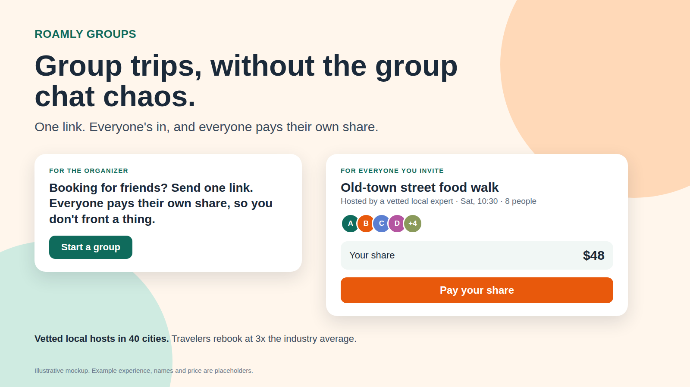

# Messaging Pillars & AI-Generated Asset — Roamly Groups

> Module 4 · Deliver Messaging That Captivates Customers — ★ Deliverable 4
>
> Turn your positioning into a message that moves people: set the market context, build a pillar per audience, activate it across surfaces, and produce one AI-generated asset.

## 1. Fro/To market shift

| | |
|---|---|
| **From** (life before) | Planning a group trip means one person becomes the unpaid travel agent: chasing replies in a group chat, fronting the money, keeping the spreadsheet, and asking friends to pay up. Nearly half of group travelers (45%) have experienced financial conflict or discomfort *[S1]*. |
| **To** (life after) | The organizer sends one link. Everyone says yes, sees the plan and their own share, and pays it. The organizer gets to enjoy the trip too. |

*Check:* This is a shift in how group travel works, not a feature list. It would still be true to someone who has never opened Roamly.

## 2. Audience segmentation

- **Number of audiences that need their own pillar:** **Two**: the **Organizer** and the **Invitee**.
- **Justification — why each is distinct enough to need its own message:**
  - *Role / buying position.* The organizer chooses and books; the invitee pays but didn't choose.
  - *Journey stage.* The organizer is an existing, experienced Roamly user. The invitee arrives from a link, often cold, possibly without an account (A3).
  - *What's at stake.* The organizer fears effort and fronting the cost. The invitee fears committing money to something they can't see or a platform they don't know.
  - One message can't do both: the organizer's promise ("you never front a thing") means nothing to an invitee deciding whether to pay.
  - **Hosts** are a third stakeholder (supply side) but not a third *external* pillar here. They are handled as an enablement audience in the launch plan (Deliverable 6). Marketplace products need both sides, so this is a deliberate scoping call, not an oversight.

## 3. Messaging pillars

*Value first, capabilities second, evidence last.*

### Pillar — Audience 1: The Organizer

| Layer | Message |
|---|---|
| **🎯 Value prop** | Plan the trip, not the paperwork. One link gets everyone in and paid, and you never front the money or chase anyone. |
| **🏆 Capabilities** | One group booking for the whole party · each person pays their own share (with a deadline) · one shared itinerary everyone can see · invite by link, no group chat required · curated experiences from vetted local hosts · *(availability and preference alignment, if in V1 scope, A4)* |
| **📊 Evidence** | **Roamly:** 12,000+ vetted local hosts across 40 cities, and travelers who rebook at 3x the industry average *[Brief]*. **Market:** 45% of group travelers have experienced financial conflict or discomfort, and 82% would pay more than their fair share to avoid money arguments *[S1]*. **[Beta]** share of groups fully paid within 72 hours, and organizer time saved, from beta organizers (named, with permission). |

### Pillar — Audience 2: The Invitee

| Layer | Message |
|---|---|
| **🎯 Value prop** | Join in seconds, see exactly what you're paying for, and pay only your share. |
| **🏆 Capabilities** | See the experience, host, time and plan before paying · see your exact share up front · pay only your own share · confirmation and reminders · one shared itinerary with the group · *(join with minimal information, account after payment, if in V1 scope, A3)* |
| **📊 Evidence** | **Roamly:** every host is vetted, across 40 cities *[Brief]*. **Market:** 41% of group travelers have felt pressured into trips they didn't want *[S1]*, which is why seeing the plan and the price before paying matters. **[Beta]** time from opening the link to paid, and share of invitees who pay within 72 hours. |

*Evidence quality check (Module 4): the market stats are specific and sourced; the Roamly stats come from the brief; the Groups-specific proof is deliberately left as beta slots rather than invented.*

## 4. Activation across surfaces

*Three surfaces chosen for a product-led motion: where the organizer is deciding, where the invitee lands, and where the brand speaks first. Each is generated from the pillar above.*

| Surface | Copy variation | Leads with |
|---|---|---|
| **In-app notification** (organizer who starts a multi-person booking) | "Booking for friends? Send one link. Everyone pays their own share, so you don't front a thing." | Organizer value prop (relief) |
| **Invite email subject line** (invitee) | "[Name] invited you to [experience]. Your share is $[amount]." | Invitee value prop (clarity, exact share) |
| **Homepage headline** | "Group trips, without the group chat chaos." Subline: "One link. Everyone's in, and everyone pays their own share." | Fro/To shift and organizer value prop |

*Review against the pillars:* none of the three could be written for Viator or Airbnb word-for-word. They name the organizer's specific pain and the specific mechanic. The homepage headline borrows the customer's own phrase ("group chat"), per Module 4's "use their words" rule. The invite subject line keeps the sender's name and the exact price, because specifics earn the open.

## 5. AI-generated asset

- **Asset type:** Launch visual combining the homepage hero with the two in-product moments (organizer prompt and invitee payment screen).
- **Prompt used:**
  > Create a single 16:9 launch visual for Roamly Groups. Lead with the homepage headline "Group trips, without the group chat chaos." and the subline "One link. Everyone's in, and everyone pays their own share." Show two cards side by side: (1) an organizer in-app prompt with the notification copy and a "Start a group" button; (2) an invitee payment screen for a local street-food walk showing the host, time, group size, "Your share $48" and a "Pay your share" button. Add one proof line: "Vetted local hosts in 40 cities. Travelers rebook at 3x the industry average." Warm, friendly, uncluttered. Mark it as an illustrative mockup.
- **Output:** 
- **What was edited and why:** The asset was built in one pass from the reviewed pillar copy, with no earlier versions to compare against. Deliberate choices: the organizer card leads with "you don't front a thing" while the invitee card leads with "your share", so each card answers one person's fear; no discount or savings claim appears, because nothing in the research supports one; and an "illustrative mockup" label marks the price, experience and group size as placeholders. *(Replace this with your own edits after you review the asset.)*

## 6. Blind-read result

**Status: a human blind read is still to be done.** Show `assets/launch-asset.png` to a peer with no context and no explanation for one minute, then record what they say below. The row of notes beneath is a self-check, not a substitute.

| Question | What they understood |
|---|---|
| Who is it built for? | *(peer to fill in)* Expected answer: the person who organizes group trips. Signal of failure: "travelers in general". |
| What does the product do? | *(peer to fill in)* Expected: books a group on local experiences and splits the payment. Failure: "a tour booking site". |
| What makes you trust it? | *(peer to fill in)* Expected: vetted local hosts, the 3x rebooking line, a clear exact share. Failure: "nothing specific". |

*Self-check (not blind):* the "3x the industry average" line is the only proof on the asset, and it is about Roamly in general, not about Groups. After the beta, replace it with a Groups-specific number.

## Link to full artifact

Messaging Builder Output: `04-messaging/roamly-messaging.md`.

## Sources

- **[S1]** CIT Bank / Harris Poll (n = 2,067, May 2026): [PR Newswire release](https://www.prnewswire.com/news-releases/82-of-group-travelers-will-pay-a-peace-tax-to-avoid-money-arguments-cit-bank-survey-finds-302807226.html)
